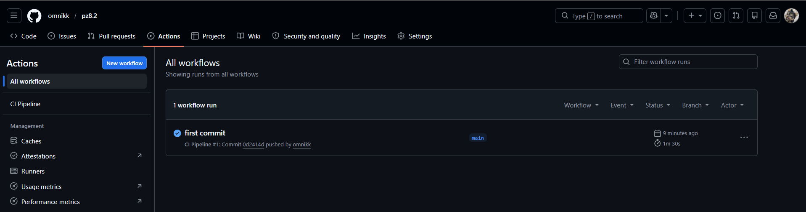
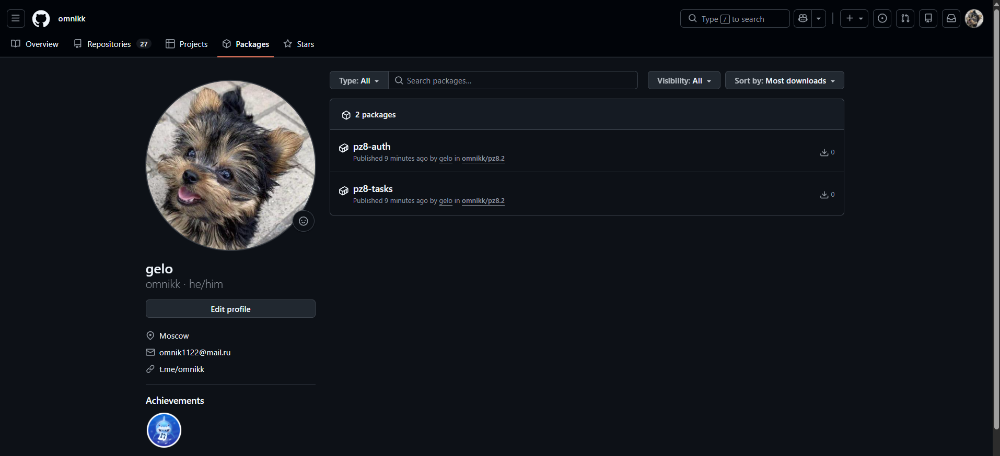

# Практическое занятие №8 — Настройка GitHub Actions для CI/CD

**Студент:** Выборнов Олег Андреевич
**Группа:** ЭФМО-02-25
**Дисциплина:** Технологии индустриального программирования
**Преподаватель:** Адышкин Сергей Сергеевич

## Цель работы

Настроить автоматический pipeline в GitHub Actions для проверки, сборки и упаковки Go-проекта в Docker-образ с публикацией в GitHub Container Registry.

## Что такое CI и CD

**CI (Continuous Integration)** — непрерывная интеграция. После каждого изменения кода система автоматически проверяет проект: устанавливает зависимости, запускает тесты, выполняет сборку. Это исключает «забывания» и сразу показывает, не сломал ли разработчик проект своими правками.

**CD (Continuous Delivery / Deployment)** — два варианта трактовки:
- *Continuous Delivery* — готовность к доставке: артефакт собран, проверен, упакован и лежит готовым к деплою.
- *Continuous Deployment* — автоматическое развёртывание: после успешной сборки артефакт сразу выкатывается на продакшен без ручного шага.

В этой работе реализован CI + Continuous Delivery: pipeline проверяет код, собирает Docker-образы и публикует их в registry. Деплой на сервер не выполняется (опциональная часть методички).

## Выбранная платформа

**GitHub Actions** — pipeline описан в файле `.github/workflows/ci.yml`. Выбор обусловлен тем, что репозиторий хранится на GitHub: используется встроенный `GITHUB_TOKEN`, не нужно настраивать дополнительные секреты, образы публикуются в бесплатный `ghcr.io`.

## Структура pipeline

```
push в main / PR в main
        │
        ▼
┌─────────────────────────────┐
│   Job: test-and-build       │
│                             │
│   1. checkout               │
│   2. setup-go 1.25          │
│   3. cache go modules       │
│   4. go mod download        │
│   5. go vet ./...           │
│   6. go test -v ./...       │
│   7. go build ./...         │
└─────────────────────────────┘
        │ (только при success + push в main)
        ▼
┌─────────────────────────────────────┐
│   Job: docker-build-and-push        │
│                                     │
│   1. checkout                       │
│   2. setup buildx                   │
│   3. login to ghcr.io               │
│   4. build & push pz8-auth          │
│   5. build & push pz8-tasks         │
└─────────────────────────────────────┘
        │
        ▼
   ghcr.io/omnikk/pz8-auth:<sha>, :latest
   ghcr.io/omnikk/pz8-tasks:<sha>, :latest
```

**Ключевое решение в архитектуре:** Docker job стартует **только** после успеха test-and-build (`needs: test-and-build`) **и только** для push в main (`if: github.ref == 'refs/heads/main'`). Это значит:
- PR-ветки прогоняют только тесты, не засоряя registry мусором
- Если тест упал — образ не публикуется

## Полный YAML

```yaml
name: CI Pipeline

on:
  push:
    branches: [main]
  pull_request:
    branches: [main]

env:
  GO_VERSION: "1.25"

jobs:
  test-and-build:
    name: Test & Build
    runs-on: ubuntu-latest

    steps:
      - name: Checkout repository
        uses: actions/checkout@v4

      - name: Setup Go
        uses: actions/setup-go@v5
        with:
          go-version: ${{ env.GO_VERSION }}

      - name: Cache Go modules
        uses: actions/cache@v4
        with:
          path: |
            ~/go/pkg/mod
            ~/.cache/go-build
          key: ${{ runner.os }}-go-${{ hashFiles('**/go.sum') }}
          restore-keys: |
            ${{ runner.os }}-go-

      - name: Download dependencies
        run: go mod download

      - name: Run go vet
        run: go vet ./...

      - name: Run tests
        run: go test -v ./...

      - name: Build all binaries
        run: go build ./...

  docker-build-and-push:
    name: Docker Build & Push to GHCR
    runs-on: ubuntu-latest
    needs: test-and-build
    if: github.event_name == 'push' && github.ref == 'refs/heads/main'

    permissions:
      contents: read
      packages: write

    steps:
      - name: Checkout repository
        uses: actions/checkout@v4

      - name: Set lowercase repository owner
        run: echo "REPO_OWNER=${GITHUB_REPOSITORY_OWNER,,}" >> $GITHUB_ENV

      - name: Set up Docker Buildx
        uses: docker/setup-buildx-action@v3

      - name: Login to GitHub Container Registry
        uses: docker/login-action@v3
        with:
          registry: ghcr.io
          username: ${{ github.actor }}
          password: ${{ secrets.GITHUB_TOKEN }}

      - name: Build and push auth image
        uses: docker/build-push-action@v5
        with:
          context: .
          file: ./deploy/Dockerfile.auth
          push: true
          tags: |
            ghcr.io/${{ env.REPO_OWNER }}/pz8-auth:${{ github.sha }}
            ghcr.io/${{ env.REPO_OWNER }}/pz8-auth:latest
          cache-from: type=gha
          cache-to: type=gha,mode=max

      - name: Build and push tasks image
        uses: docker/build-push-action@v5
        with:
          context: .
          file: ./deploy/Dockerfile.tasks
          push: true
          tags: |
            ghcr.io/${{ env.REPO_OWNER }}/pz8-tasks:${{ github.sha }}
            ghcr.io/${{ env.REPO_OWNER }}/pz8-tasks:latest
          cache-from: type=gha
          cache-to: type=gha,mode=max
```

## Пояснение шагов

### Job test-and-build

| Шаг | Что делает |
|---|---|
| `actions/checkout@v4` | Клонирует репозиторий на раннер |
| `actions/setup-go@v5` | Устанавливает Go 1.25 |
| `actions/cache@v4` | Кеширует `~/go/pkg/mod` (модули) и `~/.cache/go-build` (кеш компиляции). Ключ зависит от хеша `go.sum` — пересоздаётся только при изменении зависимостей |
| `go mod download` | Загружает зависимости из кеша или из интернета |
| `go vet ./...` | Статический анализ: ищет shadowed-переменные, неправильные форматы Printf, недостижимый код |
| `go test -v ./...` | Запускает все тесты (`-v` для подробного вывода в логах CI) |
| `go build ./...` | Проверяет, что весь код собирается |

### Job docker-build-and-push

| Шаг | Что делает |
|---|---|
| `setup-buildx-action@v3` | Включает BuildKit — современный движок Docker-сборки с поддержкой кеша GHA |
| `Set lowercase repository owner` | GHCR требует имя владельца в нижнем регистре, `${VAR,,}` в bash — преобразование в lowercase |
| `docker/login-action@v3` | Логин в `ghcr.io` через автоматически выданный `GITHUB_TOKEN` |
| `docker/build-push-action@v5` | Сборка по Dockerfile + push в registry в один шаг. `cache-from/to: type=gha` — кеш слоёв в GitHub Actions cache |

## Формирование тега Docker-образа

Каждый образ получает **два тега одновременно**:

1. **`${{ github.sha }}`** — полный SHA коммита, например `0d2414d...`. Это **неизменяемая** ссылка: образ с этим тегом всегда соответствует конкретному коммиту. Используется для отладки и точного отката.
2. **`latest`** — указывает на последний образ из main. Используется в `docker-compose.yml` на стейджинге/проде, чтобы не править тег при каждом обновлении.

Пример:
```
ghcr.io/omnikk/pz8-tasks:0d2414d2c1c3a0e9f5...
ghcr.io/omnikk/pz8-tasks:latest
```

Если потребуется откатиться — можно явно указать SHA предыдущего рабочего коммита и `docker pull` найдёт именно его.

## Хранение секретов

В данном pipeline используется **только** автоматически выданный `GITHUB_TOKEN`. Никаких внешних секретов не требуется, потому что публикация идёт во встроенный GitHub Container Registry.

`GITHUB_TOKEN` — токен, который GitHub Actions создаёт автоматически для каждого run. Он имеет ограниченные права, истекает по окончании workflow и доступен только внутри этого конкретного запуска.

В YAML на него ссылаемся как:
```yaml
password: ${{ secrets.GITHUB_TOKEN }}
```

Чтобы дать токену право push в registry, явно указываем permissions:
```yaml
permissions:
  contents: read
  packages: write
```

**Если бы понадобился внешний registry** (например, Docker Hub или private registry компании) — секреты `DOCKER_USERNAME` и `DOCKER_PASSWORD` хранились бы в **Settings → Secrets and variables → Actions**. В YAML они доступны как `${{ secrets.DOCKER_USERNAME }}`. Хранить их в коде, в `.env`-файле или в открытом виде в YAML **категорически нельзя** — это типичная ошибка постановки pipeline.

## Тесты

Чтобы CI был «честным» (не просто `|| echo "No tests"` для галочки), написаны юнит-тесты на сервисный слой auth в файле `services/auth/internal/service/auth_test.go`:

```go
func TestLogin_ValidCredentials(t *testing.T) {
    s := New()
    token, ok := s.Login("student", "student")
    if !ok {
        t.Fatal("expected login to succeed with valid credentials")
    }
    if token != "demo-token" {
        t.Errorf("expected token %q, got %q", "demo-token", token)
    }
}

func TestLogin_WrongPassword(t *testing.T) {
    s := New()
    _, ok := s.Login("student", "wrong-password")
    if ok {
        t.Fatal("expected login to fail with wrong password")
    }
}

func TestVerify_ValidToken(t *testing.T) {
    s := New()
    subject, valid := s.Verify("demo-token")
    if !valid {
        t.Fatal("expected token to be valid")
    }
    if subject != "student" {
        t.Errorf("expected subject %q, got %q", "student", subject)
    }
}
```

Пять тестов покрывают обе экспортируемые функции (`Login`, `Verify`) с позитивными и негативными сценариями. Если кто-то сломает логику авторизации — CI это поймает до мержа.

## Результат: успешный прогон pipeline



Workflow `CI Pipeline #1` для commit `0d2414d` отработал за 1m 30s, оба job'а — зелёные.

## Опубликованные образы в GHCR



Два пакета — `pz8-auth` и `pz8-tasks` — опубликованы в registry со всеми необходимыми тегами. Их можно использовать в любом окружении командой:

```bash
docker pull ghcr.io/omnikk/pz8-auth:latest
docker pull ghcr.io/omnikk/pz8-tasks:latest
```

## Структура проекта

```
pz8/
├── .github/
│   └── workflows/
│       └── ci.yml                    # GitHub Actions pipeline
├── deploy/
│   ├── Dockerfile.auth
│   ├── Dockerfile.tasks
│   ├── docker-compose.yml
│   ├── nginx.conf
│   └── tls/
├── migrations/
├── services/
│   ├── auth/
│   │   ├── cmd/auth/
│   │   └── internal/
│   │       ├── http/
│   │       └── service/
│   │           ├── auth.go
│   │           └── auth_test.go      # ЮНИТ-ТЕСТЫ для CI
│   └── tasks/
├── shared/
├── images/                           # скриншоты прогона CI
├── .dockerignore
├── .gitignore
├── go.mod
├── go.sum
└── README.md
```

## Контрольные вопросы

**1. Чем CI отличается от CD?**

CI (Continuous Integration) отвечает за **проверку и сборку**: после каждого коммита автоматически прогоняются линт, тесты, build. Цель — быстро обнаружить, что код сломан. CD (Continuous Delivery/Deployment) отвечает за **доставку**: упаковку артефакта, публикацию в registry и/или развёртывание на сервере. Continuous Delivery останавливается на готовом артефакте, Continuous Deployment автоматически выкатывает его в продакшен.

**2. Почему pipeline должен запускать тесты?**

Тесты проверяют, что код работает по спецификации. Запуск тестов в pipeline гарантирует, что:
- проверка происходит на каждое изменение, а не «когда вспомнили»;
- проверка идёт в одинаковом, чистом окружении (а не на «у меня всё работает»);
- сломанный код не попадёт в main, потому что pipeline покажет красный статус.

В моём проекте при попытке смержить PR, ломающий `Login`, тесты `TestLogin_ValidCredentials` упадут и блокируют мерж.

**3. Зачем нужен автоматический build?**

Build в CI выявляет ошибки компиляции, которые могли проскочить локально из-за разных версий Go, забытых файлов или зависимостей. Если код компилируется на CI-раннере с чистым окружением — значит он гарантированно соберётся и в продакшене. Это снижает «у меня же работало».

**4. Почему важно собирать Docker-образ в CI, а не только локально?**

- *Воспроизводимость:* образ собран в стерильной среде, без артефактов локальной машины.
- *Версионирование:* образ автоматически тегируется хешем коммита, можно точно сопоставить артефакт и исходный код.
- *Готовность к деплою:* образ сразу попадает в registry, продакшн-серверу не нужно собирать самому — только `docker pull`.
- *Безопасность:* в локальной сборке могут попасть посторонние файлы (`.env`, ключи). В CI окружение чистое, плюс `.dockerignore` контролируется через git.

**5. Что такое CI secrets?**

Это защищённое хранилище переменных в CI-системе для конфиденциальных значений: токены доступа, пароли БД, SSH-ключи, API-ключи внешних сервисов. Они зашифрованы, доступны только во время выполнения pipeline, не отображаются в логах. В GitHub Actions это **Settings → Secrets and variables → Actions**; обращение из YAML — через `${{ secrets.NAME }}`.

**6. Почему нельзя хранить токены и SSH-ключи в репозитории?**

Репозиторий доступен всем коллабораторам (в публичных — всему интернету). Любой, кто получит доступ к коду, получит и секреты. Даже если позже удалить из коммита — секрет останется в истории git и в форках. Стандартная практика: секреты живут в защищённом хранилище CI, в код попадают только их имена (`${{ secrets.X }}`), сами значения видит только runner во время выполнения.

**7. Для чего нужен тег Docker-образа?**

Тег — это имя версии образа. Он позволяет:
- *Идентифицировать* конкретную версию (по SHA коммита, например).
- *Откатываться* на предыдущую рабочую версию (`docker pull image:abc1234`).
- *Маркировать* стабильные срезы (`v1.0`, `latest`, `stable`).
- *Различать* окружения (`prod`, `staging`, `dev`).

Без тегов все образы получают `latest`, и история теряется — невозможно понять, какой код в каком образе.

**8. Что делает job docker-build?**

В моём pipeline это **второй** job (`docker-build-and-push`). Он запускается **только после** успеха job test-and-build. Внутри: логинится в registry, собирает образ для auth, собирает образ для tasks, пушит оба образа в `ghcr.io` с двумя тегами (SHA и latest). Использует BuildKit с кешированием слоёв.

**9. Почему в multi-service проекте важен working-directory?**

В одном репозитории могут лежать несколько независимых сервисов со своими `go.mod`. Команды `go test`, `go build`, `docker build` работают **из конкретной директории**. Если не указать `working-directory` — команда выполнится в корне репо, не найдёт `go.mod` нужного сервиса и упадёт с ошибкой. В моём проекте используется один общий `go.mod` в корне (Go workspace не нужен), поэтому `working-directory` явно не указывался, но в проектах с разделёнными модулями это критично.

**10. Какие риски возникают при полностью автоматическом деплое?**

- *Автоматический выкат сломанной версии* — если тесты не покрывают важный сценарий, ошибка попадёт в прод.
- *Отсутствие момента «остановиться»* — нет человека, который проверит и одобрит выкат.
- *Сложность отката* — нужна продуманная стратегия (blue-green, canary), иначе откат тоже становится автоматическим и может усугубить инцидент.
- *Утечка секретов* через автоматизацию — если pipeline скомпрометирован, атакующий получает доступ к продакшену.
- *Каскадные сбои* — если падает база миграций или внешний сервис, автоматический деплой может зациклиться на повторных попытках.

Реальные системы используют гибрид: CI полностью автоматический, а CD-этап выкатки в прод требует ручного approve (Environments в GitHub Actions, manual gates в GitLab).
